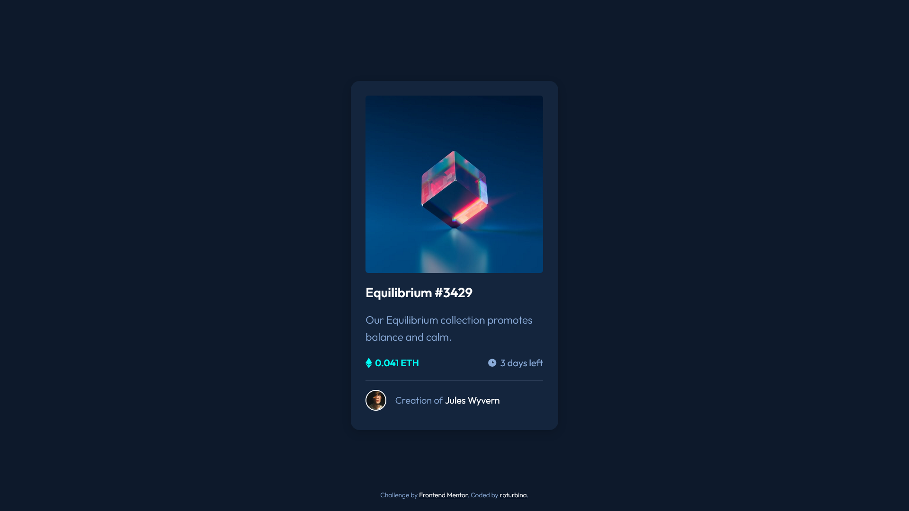

# Frontend Mentor - NFT preview card component solution

This is a solution to the [NFT preview card component challenge on Frontend Mentor](https://www.frontendmentor.io/challenges/nft-preview-card-component-SbdUL_w0U). Frontend Mentor challenges help you improve your coding skills by building realistic projects.

## Table of contents

- [Overview](#overview)
  - [The challenge](#the-challenge)
  - [Screenshot](#screenshot)
  - [Links](#links)
- [My process](#my-process)
  - [Built with](#built-with)
  - [What I learned](#what-i-learned)
  - [Useful resources](#useful-resources)
- [Author](#author)

## Overview

### The challenge

Users should be able to:

- View the optimal layout depending on their device's screen size
- See hover states for interactive elements

### Screenshot

### Links

- Solution URL: [github.com/rpturbina/nft-preview-card-component-main](https://github.com/rpturbina/nft-preview-card-component-main)
- Live Site URL: [rpturbina.github.io/nft-preview-card-component-main](https://rpturbina.github.io/nft-preview-card-component-main/)

## My process

### Built with

- Semantic HTML5 markup
- CSS custom properties
- Flexbox
- Mobile-first workflow
- BEM CSS Methodology

### Continued development

I will continue to build this NFT component card to use it for my another project. I'm still learning how to make reusable css styling for future projects.

### Useful resources

- [CSS Style Image](https://www.w3schools.com/css/css3_images.asp) - This helped me for styling the image hover overlay and give border line to the avatar image. I'd recommend it to anyone for learning to style using vanilla css.

## Author

- Website - [rpturbina.github.io](https://rpturbina.github.io)
- Frontend Mentor - [@rpturbina](https://www.frontendmentor.io/profile/rpturbina)
